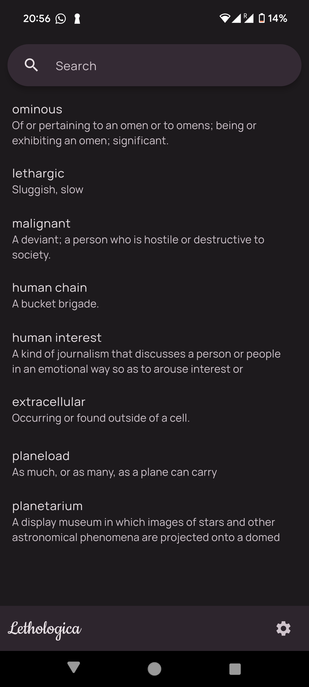
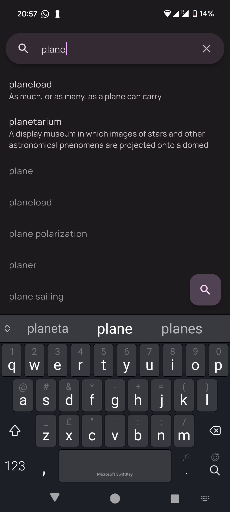
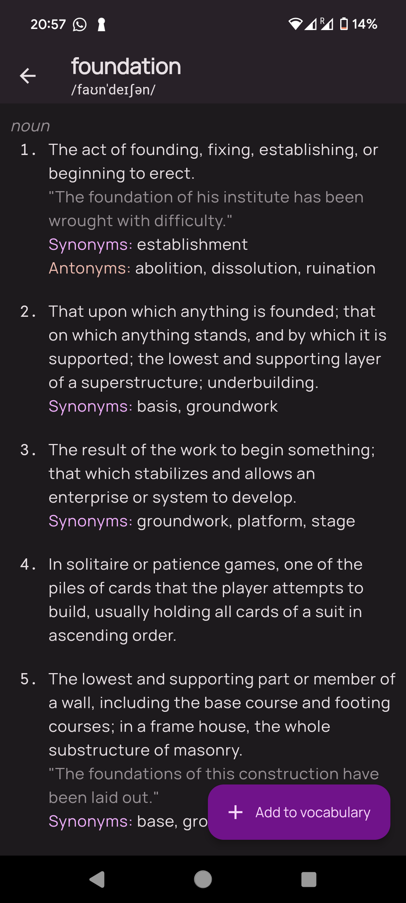
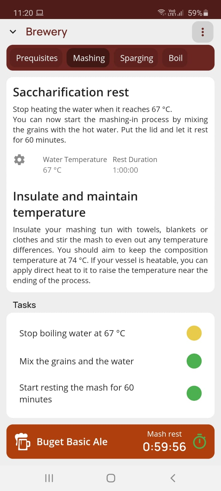
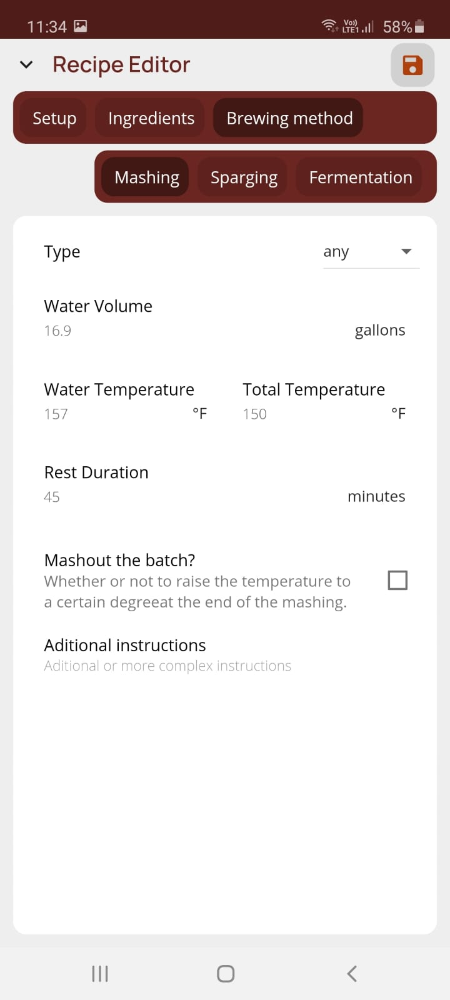
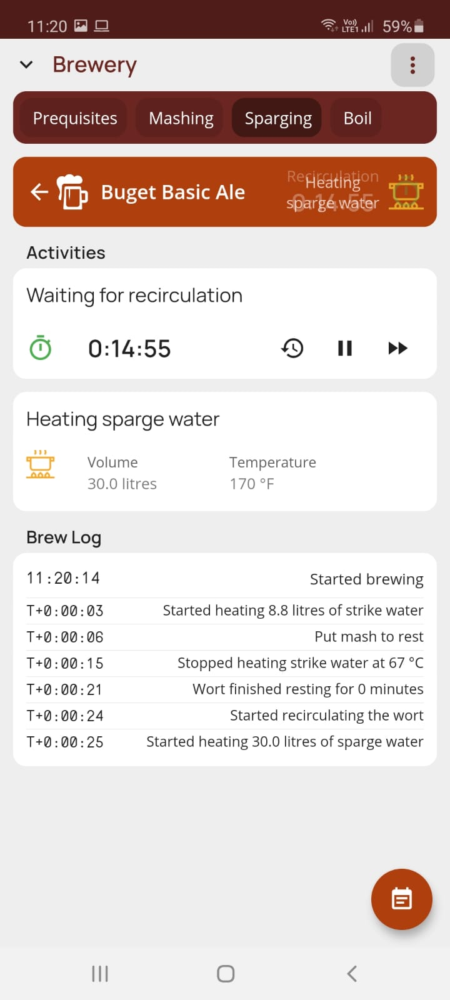
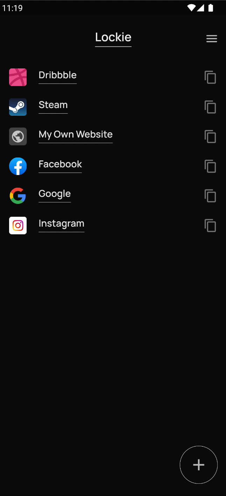
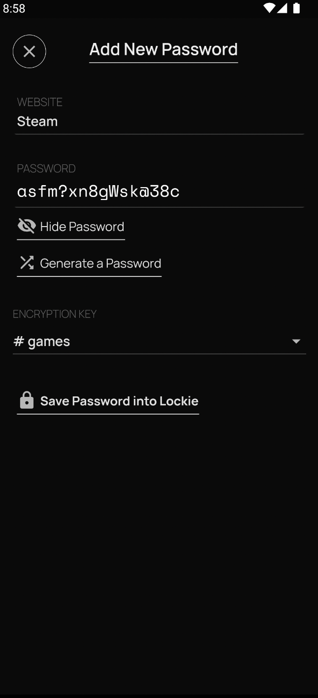

# Portfolio

### LAN Chat
This lightweight local network chat app uses TCP/UDP packets, supporting text, image file sharing, client discovery, and a clean UI. 

Published on Google Play with over 5000 installs, built using a handcrafted LAN framework for heartbeat recognition, custom names, and messages in local packets.

**Links:**
- [Github](https://github.com/nathanielxd/simple-lan-chat)
- [Google Play](https://play.google.com/store/apps/details?id=com.nathanielxd.SimpleLANChat&pli=1)

**Screenshots:**

  <table>
    <tr>
      <td style="text-align: center">
        
      </td>
      <td style="text-align: center">
        
      </td>
      <td style="text-align: center">
        
      </td>
    </tr>
  </table>

### Lethologica
Look up words in the dictionary and save them into this easy-to-use, minimalistic vocabulary.

Lethologica is a Flutter app with a clean design that provides English queries, auto suggestions, and offline word vocabulary.

**Links:**
- [Github](https://github.com/nathanielxd/lethologica)
- [Google Play](https://play.google.com/store/apps/details?id=com.brutempire.lethologica)

**Screenshots:**

  <table>
    <tr>
      <td style="text-align: center">
        
      </td>
      <td style="text-align: center">
        
      </td>
      <td style="text-align: center">
        
      </td>
    </tr>
  </table>

### Tapline
App for brewing enthusiasts with a recipe editor, calculators for bitterness, colour, ABV, OG, and assistant managing timers and to-dos for a seamless brewing experience.

**Screenshots:**

  <table>
    <tr>
      <td style="text-align: center">
        
      </td>
      <td style="text-align: center">
        
      </td>
      <td style="text-align: center">
        
      </td>
    </tr>
  </table>

### Lockie
Mobile application that protects your passwords using a mix of cloud infrastructure and local disk, fool-proof storage.

**Links:**
- [Github](https://github.com/nathanielxd/lockie)

**Screenshots:**

  <table>
    <tr>
      <td style="text-align: center">
        
      </td>
      <td style="text-align: center">
        
      </td>
      <td style="text-align: center">
        
      </td>
    </tr>
  </table>

