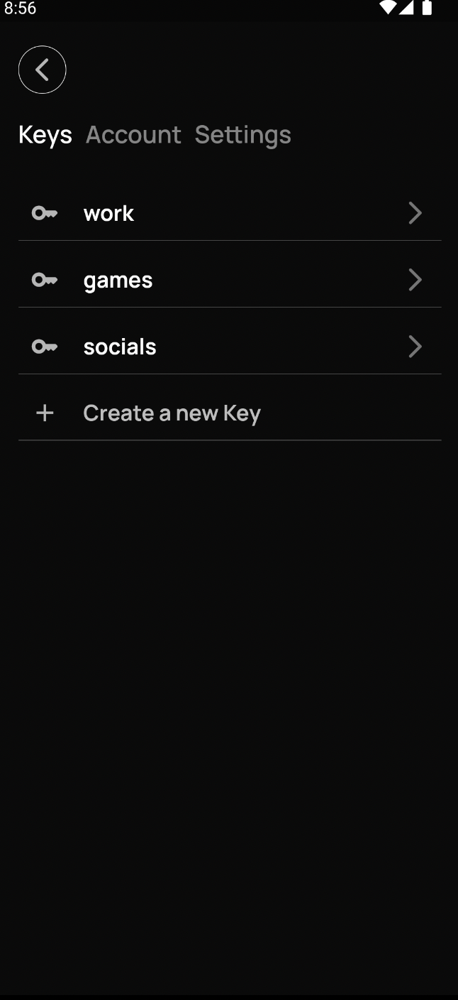

## Application Portfolio

### LAN Chat
Server-less, instantaneous chat communication on local networks using TCP/UDP sockets featuring text, image, file sharing, client discovery and a clean UI.
Published on Google Play store with over 5K downloads, the application was made using a custom lan chat framework used to recognise heartbeats, custom names and text messages in local packets.

**Links:**
- [Github](https://github.com/nathanielxd/simple-lan-chat)
- [Google Play](https://play.google.com/store/apps/details?id=com.nathanielxd.SimpleLANChat&pli=1)

**Screenshots:**

  <table>
    <tr>
      <td style="text-align: center">
        
      </td>
      <td style="text-align: center">
        
      </td>
      <td style="text-align: center">
        
      </td>
    </tr>
  </table>

### Lockie
Mobile application that protects your passwords using a mix of cloud infrastructure and local disk, fool-proof storage.

**Links:**
- [Github](https://github.com/nathanielxd/lockie)

**Screenshots:**

  <table>
    <tr>
      <td style="text-align: center">
        
      </td>
      <td style="text-align: center">
        
      </td>
      <td style="text-align: center">
        
      </td>
    </tr>
  </table>

### Tapline
Beer-making application featuring a recipe editor, beverage stat calculators for bitterness, color, ABV, OG and a brewing assistant keeping track of timers and to-dos.

**Links:**
- [Github](https://github.com/nathanielxd/tapline)
- [Google Play](https://play.google.com/store/apps/details?id=com.nathanielxd.tapline)

**Screenshots:**

  <table>
    <tr>
      <td style="text-align: center">
        
      </td>
      <td style="text-align: center">
        
      </td>
      <td style="text-align: center">
        
      </td>
    </tr>
  </table>

### Lightweight Vocabulary
A minimalist vocabulary + dictionary that allows quick english queries and offline storage of words in a simple but effective way.

**Links:**
- [Github](https://github.com/nathanielxd/lightweightvocabulary)
- [Google Play](https://play.google.com/store/apps/details?id=com.nathanielxd.lightweightvocabulary&pcampaignid=MKT-Other-global-all-co-prtnr-py-PartBadge-Mar2515-1)

**Screenshots:**

  <table>
    <tr>
      <td style="text-align: center">
        
      </td>
      <td style="text-align: center">
        
      </td>
      <td style="text-align: center">
        
      </td>
    </tr>
  </table>

